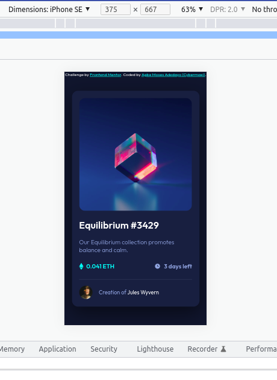
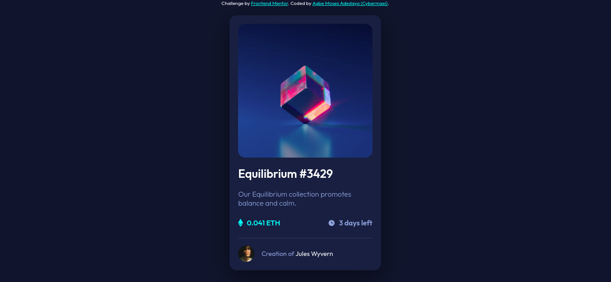

# Frontend Mentor - NFT preview card component solution

This is a solution to the [NFT preview card component challenge on Frontend Mentor](https://www.frontendmentor.io/challenges/nft-preview-card-component-SbdUL_w0U). Frontend Mentor challenges help you improve your coding skills by building realistic projects. 

## Table of contents

  - [The challenge](#the-challenge)
  - [Screenshot](#screenshot)
  - [Links](#links)
  - [Built with](#built-with)
  - [What I learned](#what-i-learned)
  - [Continued development](#continued-development)
  - [Useful resources](#useful-resources)
- [Author](#author)


### The challenge

Users should be able to:

- View the optimal layout depending on their device's screen size
- See hover states for interactive elements

### Screenshot





### Links

- Solution URL: [Add solution URL here](https://your-solution-url.com)
- Live Site URL: [Add live site URL here](https://your-live-site-url.com)


### Built with

- Semantic HTML5 markup
- CSS custom properties
- Flexbox


### What I learned

I learnt how to overlay an image with a colored overlay using the img tag and the opacity property


```html
<div class="img__container">
        
          <svg width="48" height="48" xmlns="http://www.w3.org/2000/svg">
            <g fill="none" fill-rule="evenodd">
              <path d="M0 0h48v48H0z" />
              <path
                d="M24 9C14 9 5.46 15.22 2 24c3.46 8.78 12 15 22 15 10.01 0 18.54-6.22 22-15-3.46-8.78-11.99-15-22-15Zm0 25c-5.52 0-10-4.48-10-10s4.48-10 10-10 10 4.48 10 10-4.48 10-10 10Zm0-16c-3.31 0-6 2.69-6 6s2.69 6 6 6 6-2.69 6-6-2.69-6-6-6Z"
                fill="#FFF"
                fill-rule="nonzero"
              />
            </g>
          </svg>
        </div>
```
```css
.img__container {
  background-color: var(--color-primary2);
  position: relative;
  width: 100%;
  height: 50%;
  border-radius: 1rem;
  overflow: hidden;
}
  
.img {
  opacity: 1;
  object-fit: cover;
  max-width: 100%;
  display: block;
}
.img__container svg {
  position: absolute;
  top: 50%;
  left: 50%;
  transform: translate(-50%, -50%);
  opacity: 0;
}
.img:hover {

  opacity: .5;
}

.img:hover ~ svg{
  opacity: 1;
}

```


### Continued development

Really want to perfect on overlays and positioning items on top of other elements


### Useful resources

- [Example resource 1](https://stackoverflow.com/) - This helped me for the overlay. I really liked this pattern and will use it going forward.


## Author

- Frontend Mentor - [@yourusername](https://www.frontendmentor.io/profile/cybermaxi7)
- Twitter - [@yourusername](https://www.twitter.com/cybermaxi7)

